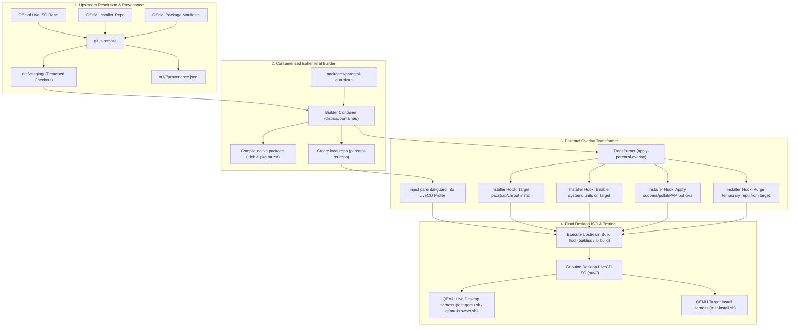

# Multi-Distro OS Reconstruction Framework & Ubuntu Desktop Port — Design Spec

**Date:** 2026-08-30  
**Status:** Approved design  
**Repo:** `/home/dat30/github/parental-os`  
**Purpose:** Establish a unified, extensible framework to reconstruct genuine upstream installation/LiveCD ISOs for all supported operating systems (CachyOS, Ubuntu Desktop LTS, etc.), inject `parental-guard` and its security enforcement plane into both the live media and the installed target, and provide automated VM testing harnesses to drive the development of `parental-guard`.

---

## 1. Vision and Architectural Principles

### 1.1 The Core Problem
Parental control tools installed post-hoc as ordinary software on desktop Linux are trivial to disable or bypass by any user with standard administrative access. To deliver real, enforceable parental controls, the operating system must ship with the control plane integrated from installation time ("at the door"), with consistent enforcement across different Linux distributions.

Previous ad-hoc attempts created synthetic minimal server/headless stubs (e.g. hardcoded `child` users and artificial `live-build` configurations with 6 CLI packages). That is discarded.

### 1.2 The Solution: Multi-Distro Reconstruction Framework
Instead of inventing synthetic custom distributions from scratch, the framework follows a strict **upstream-first reconstruction model**:
1. **Download Official Upstream Sources:** Fetch the genuine upstream LiveCD profiles, package definitions, and installer source code from official distribution repositories.
2. **Deterministic Provenance:** Dynamically resolve upstream branch heads to exact 40-character commit SHAs using `git ls-remote`, recording full provenance metadata in `provenance.json`.
3. **Declarative Parental Injection:** Apply automated, fail-closed transformers to the staged sources:
   - Inject the native `parental-guard` package into the live image package manifest.
   - Inject transformer hooks into the installer (e.g., Calamares) so that the target installation receives `parental-guard`, systemd service enablement, sudoers drop-ins, polkit rules, and PAM gating.
   - Clean up temporary build repositories from the target's package manager upon installation completion.
4. **Containerized Ephemeral Builds:** Execute the build inside an isolated, privileged container using native distribution toolchains (`archiso`/`mkarchiso` for Arch/CachyOS, `live-build`/`debootstrap` for Ubuntu/Debian) with read-only repository mounts.
5. **Dual-Phase Verification Harness:**
   - **Phase 1 (Live Session):** Boot the ISO in QEMU, verify GUI desktop autologin, verify `parental-guard` status, and validate sudoers denials.
   - **Phase 2 (Installed Target):** Drive unattended installation to a virtual disk, reboot from the installed disk, and verify that the target OS retains all security invariants.

---

## 2. Framework Architecture & Distro Adapter Contract

Every supported distribution adapter in `distros/<distro>/` and `scripts/lib/<distro>.sh` must implement the following 4 pillars:



### Pillar 1: Upstream Resolution & Provenance (`scripts/lib/<distro>.sh`)
- Function `<distro>_edition_metadata(edition)`: Declares upstream git repository URLs, branches, package manifests, and expected packages.
- Function `<distro>_resolve_ref(url, branch)`: Resolves 40-character SHA via `git ls-remote`.
- Function `<distro>_provenance_write(file, ...)`: Generates structured JSON provenance.
- Checkout into `out/<distro>/staging/<edition>/`.

### Pillar 2: Native Package Compilation & Local Repository
- Builds `parental-guard` from canonical source `packages/parental-guard/src/`:
  - Arch/CachyOS: `scripts/build-parental-guard-arch.sh` -> `.pkg.tar.zst` + `repo-add`.
  - Debian/Ubuntu: `scripts/build-parental-guard-deb.sh` -> `.deb` (3.0 quilt format) + local apt repository/chroot pool.

### Pillar 3: Declarative Installer & Image Transformation
- Injects the compiled package and security drop-ins into the live filesystem.
- Transforms installer configuration to guarantee target system receives:
  1. `parental-guard` package installed.
  2. `parental-guard.service`, `parental-guard-agent.service`, `parental-guard-enroll.service`, `parental-guard-enroll.path` enabled.
  3. `%parental-users` sudoers drop-in configured with `NOEXEC` and denylist (`apt`, `dpkg`, `systemctl stop/disable/mask parental-*`, `su`, shells, `visudo`, `date`/`timedatectl`).
  4. Polkit rule configured with priority (e.g. `00-parental-os.rules`) preventing `pkexec` elevation.
  5. PAM account gate configured (`common-account` on Ubuntu, `system-login` on CachyOS).
  6. Automatic cleanup of build-time repositories from `/etc/apt/` or `/etc/pacman.conf`.

### Pillar 4: Reproducible Verification in QEMU
- Headless / Browser-based VM execution via `compose.qemu.yml` and `distros/qemu-browser`.
- SSH assertions against live guest (`tests/qemu/assert_guest.sh`) and installed guest (`tests/qemu/assert_target.sh`).

---

## 3. Ubuntu Desktop Port Specification

### 3.1 Distribution Target
- **Distribution:** Ubuntu Desktop Latest LTS (`noble` 24.04 LTS / `plucky` 26.04).
- **Desktop Environment:** Ubuntu Desktop GNOME (`ubuntu-desktop-minimal` or `ubuntu-desktop`), GDM3, Wayland/X11, NetworkManager.
- **Installer:** Calamares Ubuntu Desktop installer (`calamares-settings-ubuntu` / `calamares`) or official Ubuntu live desktop installer.

### 3.2 Upstream Sources for Ubuntu
- **Installer & Live Settings:** `https://github.com/lubuntu-team/calamares-settings-ubuntu.git` / `https://code.launchpad.net/~ubuntu-qt-code/+git/calamares-settings-ubuntu` (Branch: `master` / `noble`).
- **Live Build Tooling & Seeds:** Official Ubuntu Desktop live configurations.

### 3.3 Ubuntu-Specific Security & Integration Adapters
1. **PAM Stack:** On Ubuntu, the single sufficient account gate for `pam_unix` account expiration/locking is `/etc/pam.d/common-account`. PAM hooks will ensure expired/blocked accounts fail at GDM3 login, SSH, console, and `su`.
2. **Sudoers:** `/etc/sudoers.d/parental-os` with mode `0440` restricting `apt`, `apt-get`, `dpkg`, `systemctl`, `su`, shells, and timing tools.
3. **Polkit:** `/etc/polkit-1/rules.d/00-parental-os.rules` returning `polkit.Result.NO` for admin actions and `org.freedesktop.policykit.exec`.
4. **Enrollment:** `parental-guard-enroll.service` + `.path` monitoring `/etc/passwd` to ensure every newly created user is automatically enrolled in `parental-users`.

---

## 4. Deliverables and Directory Layout

```
distros/
├── cachyos/                      # CachyOS adapter (Reference implementation)
│   ├── calamares/                # Calamares overlay & unattended configs
│   └── container/                # Ephemeral Arch builder container
└── ubuntu/                       # Ubuntu adapter (Port from CachyOS)
    ├── calamares/                # Ubuntu Calamares overlay transformer
    │   ├── apply-parental-overlay.py
    │   └── unattended/           # Unattended install config for QEMU testing
    └── container/                # Ephemeral Ubuntu/Debian builder container
        ├── Dockerfile
        └── build-edition.sh

scripts/
├── lib/
│   ├── common.sh                 # Shared helpers
│   ├── cachyos.sh                # CachyOS metadata & provenance
│   ├── ubuntu.sh                 # Ubuntu metadata & provenance
│   └── qemu.sh                   # QEMU harness helpers
├── build-cachyos.sh              # Host driver for CachyOS
├── build-ubuntu.sh               # Host driver for Ubuntu
├── build-parental-guard-arch.sh  # PKGBUILD builder
├── build-parental-guard-deb.sh   # Debian package builder
└── test-install.sh               # Unattended target install test driver
```
